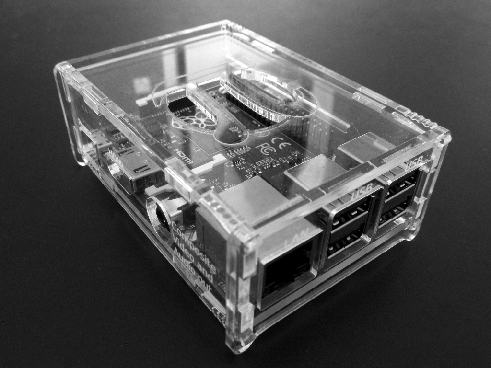
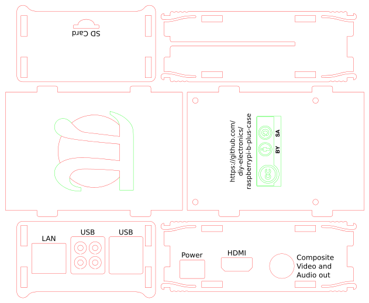

Raspberry Pi Model B+, 2 B and 3 B Case
==================================

This is a simple acrylic lasercut case for the Raspberry Pi Model B+, 2 B and 3 B.

Build Instructions
------------------

    green:	vector engraving
    black:	raster engraving
    red:	cut

Detailed instructions coming soon.™

BOM
---

- 3mm acryl
- 4x M2.5 10mm screws
- 4x M2.5 screw nuts

Visicut color-mapping
---------------------

If you use Visicut (https://github.com/t-oster/VisiCut) you can find a working color-mapping under 
[visicut/raspberrypi-b-plus-case.xml](visicut/raspberrypi-b-plus-case.xml)

License
-------

 raspberrypi-b-plus-case by <a xmlns:cc="http://creativecommons.org/ns#" href="https://github.com/diy-electronics/raspberrypi-b-plus-case" property="cc:attributionName" rel="cc:attributionURL">https://github.com/diy-electronics/raspberrypi-b-plus-case</a> is licensed under a <a rel="license" href="http://creativecommons.org/licenses/by-sa/4.0/">Creative Commons Attribution-ShareAlike 4.0 International License</a>.

Raspberry Pi is a trademark of the Raspberry Pi Foundation

Based on the [Adafruit Pi Box - Enclosure for Raspberry Pi Model A or B](https://www.adafruit.com/products/859)
